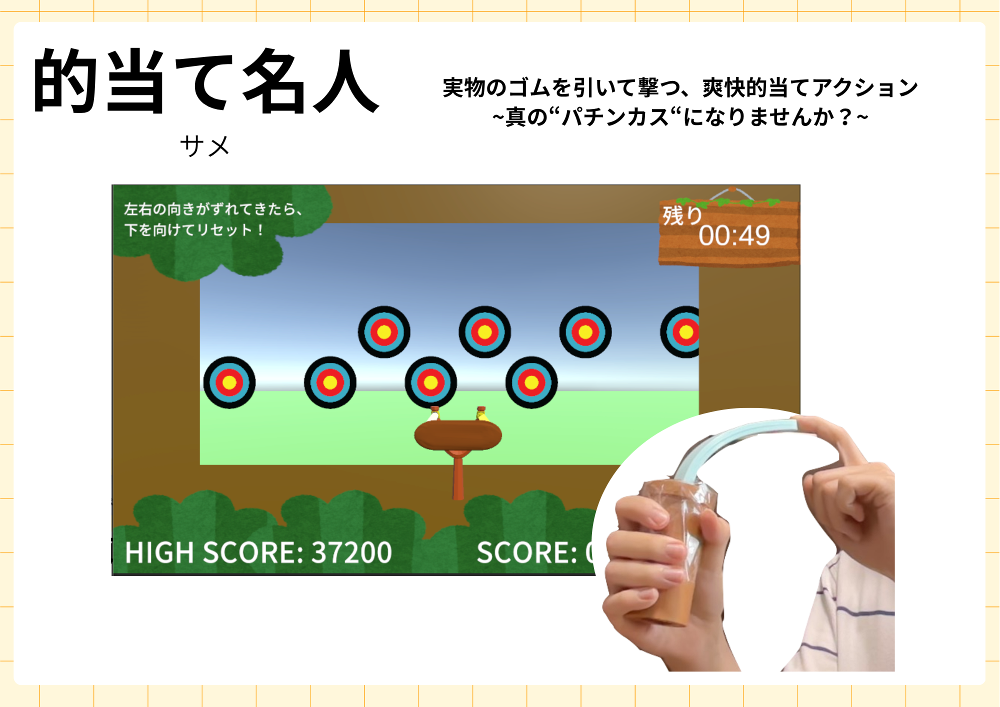
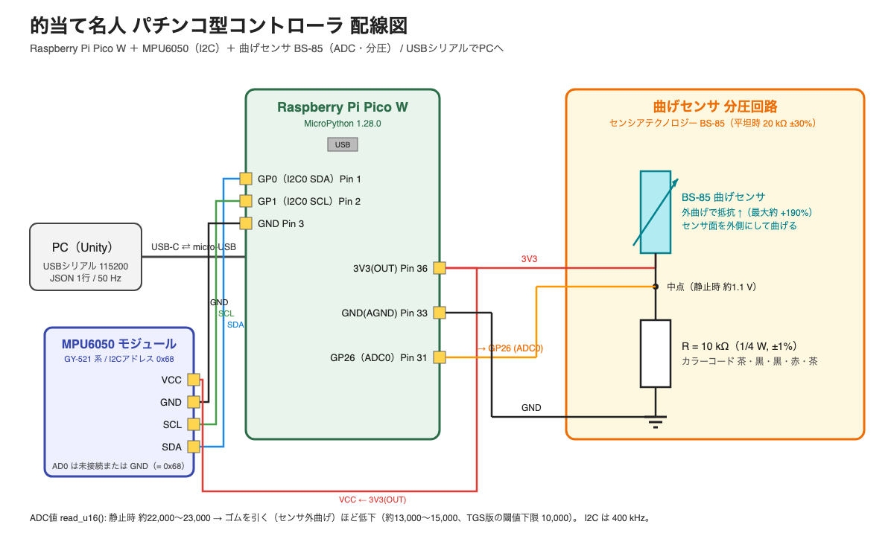
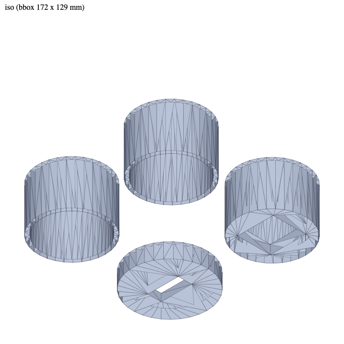
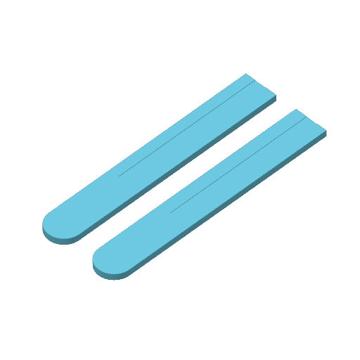
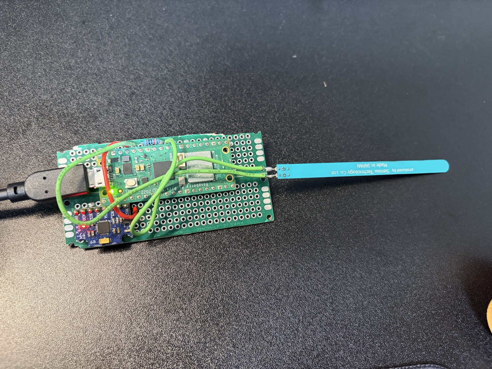
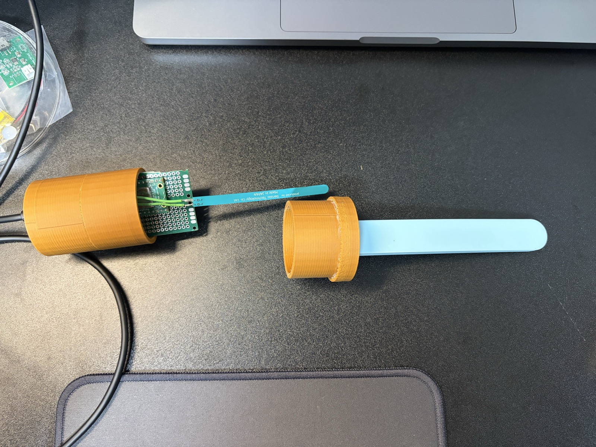
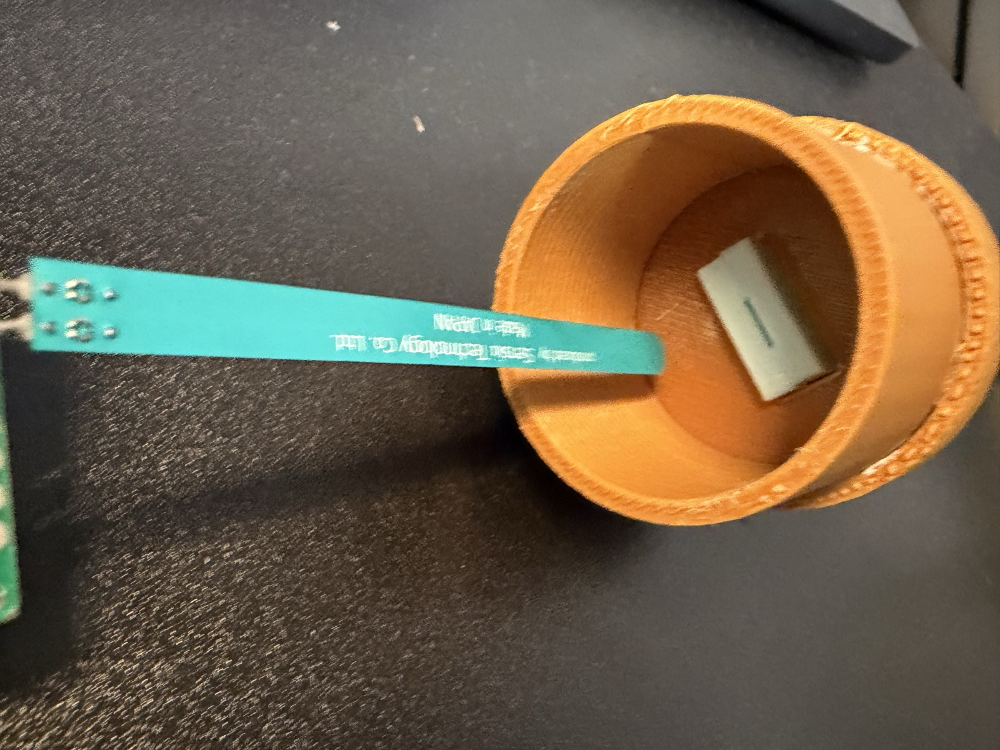
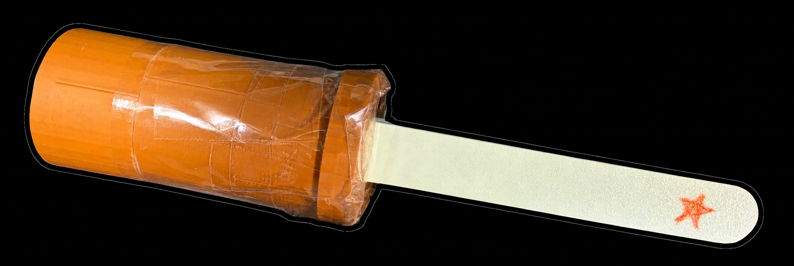

# 的当て名人 パチンコ型コントローラ（Slingshot Controller）

実物のゴムを引いて放す動作で遊ぶ、自作のパチンコ型ゲームコントローラです。
ゴム部分に仕込んだ曲げセンサで「引き具合」を、グリップ内のIMUで「向き」を読み取り、USBシリアルでPCへ送ります。
的当てゲーム「的当て名人」（BitSummit 2026・東京ゲームショウ2026 出展）のために作りました。



## 特徴

- **身体動作とゲーム入力が一対一で対応** — ゴムのしなり具合がそのまま弾速・威力になる
- **強さと正確さのトレードオフ** — 強く引くほど速いが、手ブレで狙いがズレる
- **部品点数が少ない** — マイコン1枚、センサ2個、抵抗1本、3Dプリント部品4種
- **プロトコルが単純** — 1行JSONを50Hzで送るだけ。Unity以外からも受け取れる

## 構成

```
┌─ コントローラ ────────────────────┐   USBシリアル   ┌─ PC ────────────────────┐
│ 曲げセンサ BS-85 ──(分圧 10kΩ)── ADC0 │ ────────────→ │ 受信スレッド → JSON解析 │
│ MPU6050 ───────────(I2C)──── Pico W │ 115200 / JSON │ → 姿勢推定（相補フィルタ）│
└──────────────────────────────────┘   50 Hz         │ → ゲームへ反映            │
                                                     └────────────────────────┘
```

| 部位 | 内容 |
|---|---|
| マイコン | Raspberry Pi Pico W（MicroPython 1.28.0） |
| 引き具合 | センシアテクノロジー 高性能曲げセンサ BS-85（抵抗変化型）＋ 10 kΩ 分圧 → ADC0（GP26） |
| 向き | MPU6050（6軸IMU）→ I2C0（GP0/GP1） |
| 筐体 | PLAのグリップ筒（3Dプリント）＋ TPUのセンサカバー（3Dプリント） |
| 接続 | USBケーブル（バスパワー） |

## リポジトリ構成

```
hardware/
  wiring.svg / wiring.png     配線図
  BOM.md                      部品表
  3d/grip.stl                 グリップ（筒×3、TPUカバーがハマるフタ）
  3d/bendsensor_cover.3mf     曲げセンサカバー（TPU）
  images/                     写真
firmware/
  main.py                     Pico W 用（MicroPython）
  imu.py, vector3d.py         MPU6050 ドライバ（MIT, Peter Hinch / Sebastian Plamauer）
unity/
  ControlerManager.cs         Unity 側の受信スクリプト
LICENSE.md                    ライセンスの要約と商用利用の連絡先
LICENSE-HARDWARE.txt          CC BY-NC-SA 4.0 全文
LICENSE-SOFTWARE.md           PolyForm Noncommercial 1.0.0 全文
THIRD_PARTY_NOTICES.md        同梱した第三者コードのライセンス
```

## 作り方

### 1. 部品

[hardware/BOM.md](hardware/BOM.md) を参照。主要部品は Pico W、MPU6050 モジュール、BS-85、10 kΩ 抵抗、ユニバーサル基板、USBケーブル。

### 2. 配線



| Pico W | 接続先 |
|---|---|
| GP0（Pin 1） | MPU6050 SDA |
| GP1（Pin 2） | MPU6050 SCL |
| 3V3(OUT)（Pin 36） | MPU6050 VCC、曲げセンサの一端 |
| GND | MPU6050 GND、10 kΩ 抵抗の一端 |
| GP26 / ADC0（Pin 31） | 曲げセンサのもう一端 ＝ 10 kΩ 抵抗のもう一端（分圧の中点） |

- 曲げセンサは **センサ面（金属パターンが見える面）を外側**にして曲がるように取り付けると抵抗が上がり、ADC値が下がります。静止時 約22,000、強く引いて 約10,000〜15,000（16bit）
- センサ端子のはんだ付けは 190 ℃以下の低温はんだを推奨（基材がPET）

### 3. 3Dプリント

| 部品 | ファイル | 材料 | 数 |
|---|---|---|---|
| グリップ筒（外径45・内径40・高さ30 mm） | `hardware/3d/grip.stl` | PLA | 3（うち1つは端面に角穴つき。ケーブルを出す側） |
| TPUカバーがハマるフタ（外径50・高さ10 mm、センサ用スリット 20.5×9 mm） | `hardware/3d/grip.stl` | PLA | 1 |
| 曲げセンサカバー（140×20×4 mm、浅い凹みつき） | `hardware/3d/bendsensor_cover.3mf` | TPU | 2 |

プリント設定: 0.4 mm ノズル、スライサーの既定設定で印刷できます（Bambu Studio で確認）。
**TPU のカバーはインフィル 100% を推奨**します（展示版は既定の 15% で印刷しましたが、100% の方が良い）。そのほかの設定は自由に変えて構いません。

| グリップの4パーツ（grip.stl） | TPU カバー（bendsensor_cover.3mf） |
|---|---|
|  |  |

### 4. 組み立て

**基板**

1. ユニバーサル基板を幅 40 mm 以下にカットし、Pico W（ピンヘッダ）と MPU6050 モジュール、10 kΩ 抵抗を実装して配線する
2. 曲げセンサの端子に配線をはんだ付けし（低温はんだ）、基板の ADC0 側・3V3 側へ接続する
   ※ **曲げセンサは繊細です。作業中に折らないよう注意**してください



**プリント部品の接着（2つの組み立て品を作る）**

3. **上側**: TPU カバーがハマるフタ ＋ 筒 1 つ ＋ TPU カバー をゴリラグルーで接着する。TPU カバーは 2 枚を凹み同士で合わせ、**センサが入る隙間以外を接着**してポケットを作り、フタのスリットの位置に固定する
4. **下側**: 筒 1 つ ＋ 端面に角穴のある筒 をゴリラグルーで接着する（角穴からケーブルを出す）
   どちらも、接着剤が乾くまでテープで仮固定する

**挿入**

5. はんだ付け済みの基板を、接着済みのプリント部品に挿入する。曲げセンサを上側のフタのスリットに通して TPU カバーのポケットへ差し込み、基板を下側の筒へ収める
6. 上側と下側を合わせて固定する。固定は**テープを推奨**

| 手順 | 写真 |
|---|---|
| 部品が揃った状態 |  |
| 曲げセンサをスリットに通す |  |
| 組み立て済みのコントローラ |  |

### 5. ファームウェア

1. Pico W に MicroPython 1.28.0 の UF2 を書き込む
2. Thonny で `firmware/main.py`, `imu.py`, `vector3d.py` を Pico に保存する
3. USB 接続すると自動起動し、50 Hz で JSON を送り始める（動作中は本体 LED が点滅）

### 6. 通信プロトコル

USB CDC シリアル（115200 bps）、1 行 1 パケット、末尾 `\n`、50 Hz。

```json
{"t_ms":12345,"bend":21800,"accel":{"x":0.01,"y":0.02,"z":1.01},"gyro":{"x":0.1,"y":-0.2,"z":0.3}}
```

| フィールド | 意味 | 単位 |
|---|---|---|
| t_ms | Pico 起動からの経過時間 | ms |
| bend | 曲げセンサの ADC 生値（read_u16） | 0〜65535 |
| accel | 加速度（±4 g レンジ） | g |
| gyro | 角速度（±1000 dps レンジ、41 Hz LPF） | deg/s |

エラー時は `{"error":"..."}` を送ります。

### 7. Unity で受け取る

`unity/ControlerManager.cs` をシーンに置き、Inspector の Port Name にシリアルポート名（macOS: `/dev/cu.usbmodem*`、Windows: `COM*`）を入れます。
受信は別スレッドで行い、`FixedUpdate` でキューから取り出して `Bend` / `Accel` / `Gyro` プロパティに反映します。
向きの推定やゲームへの反映はゲーム側の実装に任せています（このリポジトリには含みません）。

## 展示実績

- BitSummit 2026（京都）— 約150人がプレイ
- EC2026（京都産業大学）
- 東京ゲームショウ 2026（神ゲー創造主エボリューション 2026 二次審査通過作品として出展）

## 既知の課題・今後

- ゴム（TPU）部分が長期使用で少しずつ変形する
- 左右の向き（ヨー）はIMU単体では補正できないため、下を向いて構え直すリセット操作をゲーム側で用意している。磁気センサの追加を検討中
- トリガーボタンの追加、ネジ止めの蓋、握りやすいカバー形状（改良案）

## ゲーム本体

「的当て名人」のビルド版: 準備中（配布先が決まり次第ここに載せます）

## ライセンス

本プロジェクトは **非商用に限り** 自由に利用・改変・再配布できます。商用利用（キットや完成品の販売、有料ゲームへの組み込みなど）を希望する場合は、下記の連絡先までご相談ください。個別にライセンスします。

- ハードウェア（回路図・3Dデータ・図面・組立手順・写真）: **CC BY-NC-SA 4.0**（クレジット表示・非商用・改変版は同条件で共有）
- ファームウェア（`firmware/main.py`）・Unity スクリプト（`unity/ControlerManager.cs`）: **PolyForm Noncommercial 1.0.0**
- `firmware/imu.py`, `vector3d.py` は Sebastian Plamauer / Peter Hinch による **MIT ライセンス**のコードです（原ライセンスのまま）
- 商用ライセンスの問い合わせ: matsumatsu1112@icloud.com

非商用ライセンスのため、OSHWA／OSI の定義上の「オープンソース」ではなく、「設計とソースの公開（非商用）」です。全文は [LICENSE-HARDWARE.txt](LICENSE-HARDWARE.txt)、[LICENSE-SOFTWARE.md](LICENSE-SOFTWARE.md)、要約は [LICENSE.md](LICENSE.md) を参照してください。

**License (English)**
This project is published for **non-commercial use only**.
Hardware (schematics, 3D files, drawings, assembly instructions, photos): CC BY-NC-SA 4.0.
Firmware and Unity scripts: PolyForm Noncommercial 1.0.0. `imu.py` / `vector3d.py` remain under their original MIT license.
Selling kits, finished units, or clones of this controller, or including it in a commercial product, requires a separate commercial license. For commercial licensing, contact: matsumatsu1112@icloud.com

## 作者

サメ — X: [@tDo8GKZwwU86364](https://x.com/tDo8GKZwwU86364)
